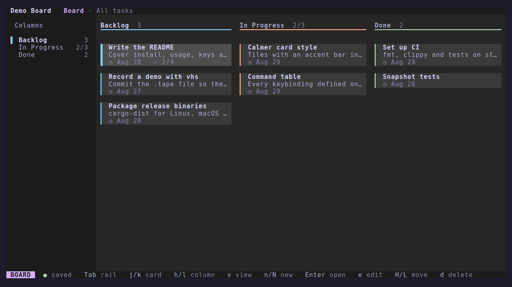
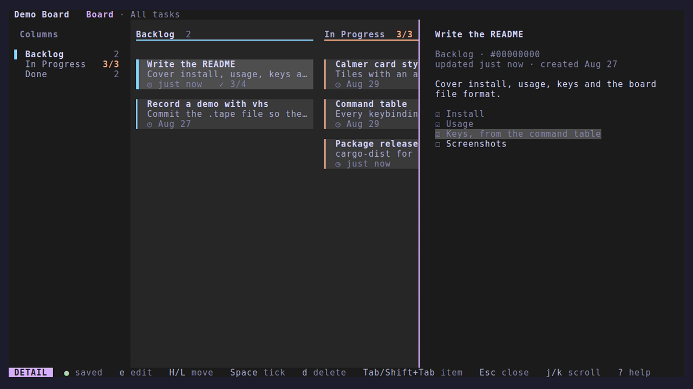
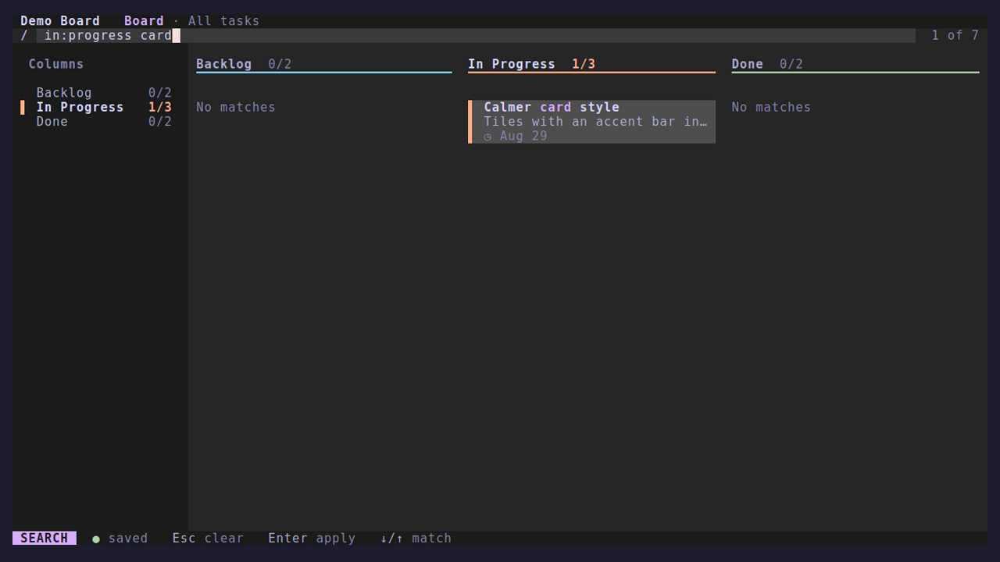
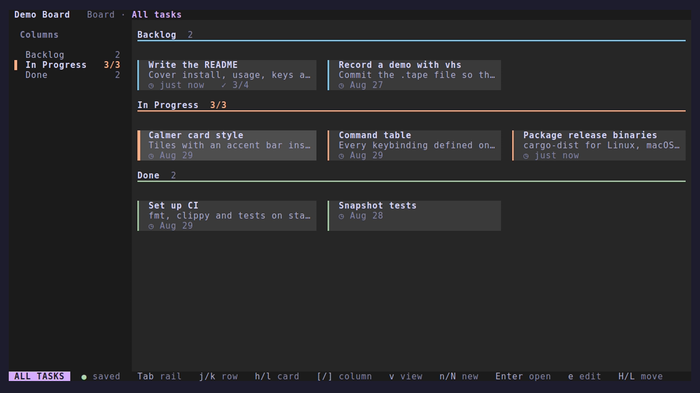

# tui-kanban

A calm, keyboard-first Kanban board for the terminal. Each project keeps
its board in a small JSON file next to its code, found the way git finds
`.git`, so running `tui-kanban` anywhere in the project opens it.


- **Board and All tasks views.** Lanes for the workflow, or every task
  grouped by column. Narrow terminals get one lane at a time with a tab
  strip; wide ones pin the detail drawer beside the lanes.
- **Fast to drive.** `h j k l`, `1`–`9` and `g` + a lane's initial to
  move; `H`/`L` and `J`/`K` to move cards; a command palette (`:`), a
  which-key panel (`Space`), and undo and redo for every change.
- **Markdown descriptions** with checklists you tick from the detail
  drawer, edited in a built-in editor or your own `$EDITOR`.
- **Fuzzy search with filter terms**: `in:progress`, `#tag`,
  `updated:<7d`, with the matched letters highlighted.
- **Columns managed in the app**, with colours, work-in-progress limits
  and lanes that collapse to a strip.
- **The mouse works too**: click, double-click, scroll, and drag cards.
- **Safe with your data**: saved in the background, atomically; changes
  another program makes to the file are picked up, and never silently
  overwritten.
- **Themes**: the four Catppuccin flavours, picked to match your
  terminal, 16 colours, your own, or none with `NO_COLOR`.

## Install

With a [Rust toolchain](https://rustup.rs), 1.88 or newer:

```sh
cargo install --git https://github.com/Theblackcat98/tui-kanban
```

or, from a clone, `cargo install --path .`. Release binaries and a
crates.io release are planned.

## Usage

```sh
cd ~/src/my-project
tui-kanban
```

tui-kanban looks for `.tui-kanban.json` in the current directory and
each one above it, stopping at the git root. If there isn't one, it
asks whether to create one here or to open your personal board
(`~/.local/share/tui-kanban/boards/personal.json`).

| Option | |
|---|---|
| `--board <PATH OR NAME>` | Open a board file, or a board by name: a recent board with that name, or a personal board of that name in the data directory |
| `--theme <NAME>` | `auto` (the default), `latte`, `frappe`, `macchiato`, `mocha`, `ansi`, or your own; see [docs/themes.md](docs/themes.md) |
| `--no-animation` | Turn off animations; a non-empty `REDUCE_MOTION` does the same |
| `--no-mouse` | Leave the mouse to the terminal, so text can be selected as usual |
| `tui-kanban config` | Print where the config file is; add `--print-default` for a commented one with every default |

A non-empty `NO_COLOR` turns colour off; state is then shown with bold,
reversed and underlined text.

Press `b` to switch between recent boards, `?` for the keys on the
screen you're on, `:` for every command, and `Space` for a panel of the
keys you can press next.

| The board | A card's details |
|---|---|
|  |  |
| **Search with filter terms** | **All tasks** |
|  |  |

## Keys

The essentials:

| Key | |
|---|---|
| `h j k l` / arrows | Move between lanes and cards |
| `Enter` | Open the selected card |
| `n` / `a` | New card (with a description) / quick add to the lane |
| `e` / `E` | Edit the card / its description in `$EDITOR` |
| `H` `L` / `J` `K` / `m` | Move the card to another lane / up or down / to any lane |
| `d` / `y` | Delete / duplicate the card |
| `u` / `U` | Undo / redo |
| `/` | Search; `Esc` clears it |
| `v` | Switch between Board and All tasks |
| `Tab` | Focus the column rail, to manage columns |
| `z` | Collapse or expand a lane |
| `b` | Switch boards |
| `?` / `:` / `Space` | Help / command palette / which-key |
| `q` | Quit |

From the column rail, `a` adds a column, `r` renames it, `d` deletes it
(asking where its tasks go), `J`/`K` reorder, `c` picks its colour and
`w` sets a work-in-progress limit.

<details>
<summary>Every key, generated from the command table</summary>

<!-- keys:start -->

#### Navigation

| Keys | | Where |
|---|---|---|
| `h/l  ←/→` | previous / next column | Board |
| `j/k  ↓/↑` | next / previous card | Board |
| `h/l  ←/→` | card to the left / right | All tasks |
| `j/k  ↓/↑` | row down / up | All tasks |
| `[/]` | previous / next column group | All tasks |
| `PgUp/PgDn` | up / down five cards or rows | Board, All tasks |
| `Home/End  g g/G` | first / last card | Board, All tasks |
| `j/k  ↓/↑  l/h  →/←` | next / previous column | Column rail |
| `Home/End` | first / last column | Column rail |
| `1–9` | lane by its number | Board, All tasks, Column rail, Move to |
| `g + letter` | lane by its initial | Board, All tasks |
| `Enter` | focus cards | Column rail |
| `Tab / Shift+Tab` | focus rail / cards | Board, All tasks, Column rail |
| `v` | Board / All tasks | Board, All tasks, Column rail |
| `b` | switch board | Board, All tasks, Column rail |

#### Tasks

| Keys | | Where |
|---|---|---|
| `Enter` | open details | Board, All tasks |
| `n/N` | new task below / above | Board, All tasks, Column rail |
| `a` | quick add to this lane | Board, All tasks |
| `e` | edit task | Board, All tasks, Details |
| `y` | duplicate task | Board, All tasks, Details |
| `m` | move to… | Board, All tasks, Details |
| `E` | edit description in $EDITOR | Board, All tasks, Details |
| `d` | delete task | Board, All tasks, Details |
| `H/L` | move task left / right | Board, All tasks, Details |
| `J/K` | move task down / up | Board, All tasks, Details |
| `u/U  Ctrl+Z/Ctrl+R` | undo / redo | Board, All tasks, Column rail, Details |
| `/` | search | Board, All tasks, Column rail |
| `Esc` | back / clear search | Board, All tasks, Column rail, Search |
| `Ctrl+N/Ctrl+P` | next / previous match | Board, All tasks |
| `Backspace` | remove the last filter term | Board, All tasks, Column rail |

#### Columns

| Keys | | Where |
|---|---|---|
| `a` | add a column | Column rail |
| `r` | rename column | Column rail |
| `d` | delete column | Column rail |
| `J/K` | move column down / up | Column rail |
| `c` | column colour | Column rail |
| `w` | work-in-progress limit | Column rail |
| `z` | collapse / expand lane | Board, Column rail |

#### Details

| Keys | | Where |
|---|---|---|
| `PgUp/PgDn` | scroll up / down a page | Details |
| `j/k  ↓/↑` | scroll down / up a line | Details |
| `Space` | tick / untick checklist item | Details |
| `Tab/Shift+Tab` | next / previous checklist item | Details |
| `Esc / q` | close details | Details |

#### Editor, search and dialogs

| Keys | | Where |
|---|---|---|
| `Enter` | apply | Search |
| `↓/↑  Ctrl+N/Ctrl+P` | next / previous match | Search |
| `Tab / Shift+Tab` | switch field | Editor |
| `Ctrl+S / Enter` | save (Enter in the title) | Editor |
| `Esc / Ctrl+C` | cancel | Editor |
| `y` | confirm | Delete |
| `n / Esc / q` | cancel | Delete |
| `Ctrl+O` | description in $EDITOR | Editor |
| `↓/↑  Ctrl+N/Ctrl+P` | next / previous | Command palette |
| `Enter` | run | Command palette |
| `Esc / Ctrl+C` | close | Command palette |
| `y` | confirm | Discard changes |
| `n / Esc / q` | keep editing | Discard changes |
| `r` | load it (u brings yours back) | Changed on disk |
| `o` | overwrite it with yours | Changed on disk |
| `Esc` | decide later | Changed on disk |
| `y` | without saving | Quit |
| `n / Esc` | stay | Quit |
| `j/k  ↓/↑` | next / previous | Move to, Column colour, Boards |
| `Enter` | pick | Move to |
| `Esc / q` | close | Move to, Column colour, Boards |
| `Enter` | open | Boards |
| `c` | create a board here | No board here |
| `p` | open your personal board | No board here |
| `Enter` | set | Column colour |
| `Enter` | save | Column |
| `Esc / Ctrl+C` | cancel | Column |
| `y` | confirm | Delete column |
| `h/l  ←/→` | where its tasks go | Delete column |
| `n / Esc / q` | cancel | Delete column |
| `y` | move anyway | Work-in-progress limit |
| `n / Esc / q` | don't move | Work-in-progress limit |
| `Enter` | add | Quick add |
| `Esc / Ctrl+C` | done | Quick add |

#### General

| Keys | | Where |
|---|---|---|
| `j/k  ↓/↑` | scroll down / up | Help |
| `Esc / q / ?` | close | Help |
| `?` | this help | Board, All tasks, Column rail, Details |
| `: / Ctrl+K` | command palette | Board, All tasks, Column rail, Details |
| `Space` | show the keys you can press | Board, All tasks, Column rail |
| `q` | quit | Board, All tasks, Column rail, No board here |
| `Ctrl+C` | quit (anywhere) | anywhere |

<!-- keys:end -->

</details>

Keys can be changed in the config file.

### Mouse

Click a card to select it and double-click to open it; click a lane
header, a rail entry or a view name to go there, and a hint in the
status line to run it. The wheel scrolls lanes, the All tasks grid, the
detail drawer and menus. Drag a card to move it: a line shows where it
will land, and dropping it on a rail entry or a collapsed lane puts it
at the end of that column. Capturing the mouse stops the terminal's own
text selection (most terminals still select with `Shift` held); use
`--no-mouse`, or `mouse = false` in the config file, to turn it off.

## Configuration

`~/.config/tui-kanban/config.toml` (`$XDG_CONFIG_HOME` is respected;
`%APPDATA%` on Windows) is optional, and command-line options win over
it. `tui-kanban config --print-default` prints a commented copy with
every setting and every command's keys.

```toml
theme = "latte"
animations = true
mouse = true
# The columns of a new board.
columns = ["Ideas", "Doing", "Done"]
# "auto" ("Sep 3"), or a pattern with %Y %y %m %d %e %b %B.
date_format = "%Y-%m-%d"

[keys]
new_task = "+"
search = ["/", "ctrl+f"]
```

The file is checked when tui-kanban starts: a misspelt setting or
command, or two commands sharing a key where both apply, is reported
rather than ignored.

## The board file

A board is one pretty-printed JSON file, so it diffs well and can be
committed with the project (or added to `.gitignore`):

```json
{
  "schema_version": 1,
  "name": "Website",
  "columns": [
    {
      "id": "in-progress",
      "name": "In Progress",
      "color": "peach",
      "wip_limit": 3,
      "tasks": [
        {
          "id": "0d4c1d2e-5b9a-4c55-9c1e-4a1b8f3e2a10",
          "title": "Write the README",
          "description": "- [x] Install\n- [ ] Keys",
          "created_at": 1787820000000,
          "updated_at": 1787906400000
        }
      ]
    }
  ]
}
```

- Column `color` (a Catppuccin colour name or `#rrggbb`), `wip_limit`
  and `collapsed` are optional. Without a colour, one is picked from the
  column's id, so it stays the same when columns move.
- Times are Unix milliseconds. Descriptions are Markdown.
- Fields tui-kanban doesn't know are kept and written back. A file from
  an older version is copied to `<file>.bak-v<version>` before it is
  upgraded; one from a newer version isn't opened.
- Saving replaces the file atomically. If another program changes it,
  tui-kanban loads the new version, or, with unsaved changes of its own,
  asks which to keep.

Where files live:

| | |
|---|---|
| A project's board | `.tui-kanban.json`, in the project |
| Personal and named boards | `~/.local/share/tui-kanban/boards/` (`$XDG_DATA_HOME`) |
| Config and themes | `~/.config/tui-kanban/` (`$XDG_CONFIG_HOME`) |
| Recent boards, the dismissed tip | `~/.local/state/tui-kanban/` (`$XDG_STATE_HOME`) |

[examples/demo-board.json](examples/demo-board.json) is a small board
to try on a copy:

```sh
cp examples/demo-board.json /tmp/demo.json && tui-kanban --board /tmp/demo.json
```

## Development

```sh
cargo test                         # unit, key-sequence and snapshot tests
cargo clippy --all-targets -- -D warnings
cargo fmt --check
```

- The look is specified in [docs/design.md](docs/design.md); the
  snapshot tests in `tests/snapshots/` are its executable form. After a
  deliberate visual change, review the new snapshots with
  `cargo insta review` (or `INSTA_UPDATE=always cargo test`).
- The key reference above comes from the command table in
  `src/command.rs`; `UPDATE_README=1 cargo test --test readme`
  regenerates it.
- The demo and screenshots are recorded with
  [vhs](https://github.com/charmbracelet/vhs):
  `cargo build --release && vhs docs/demo.tape`.
- The minimum supported Rust version is 1.88, checked in CI.

## License

[MIT](LICENSE)
